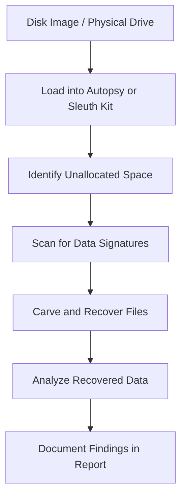

# Reviewing-Unallocated-Space-Extracting-Data-with-Tools-Digital-Investigation-Processes
## AIM:
To review unallocated space in a disk image, extract data using forensic tools, and understand the digital investigation process.
## REQUIREMENTS
- Autopsy or FTK Imager
- Sleuth Kit (TSK)
- Hex Editor (e.g., HxD)
- Operating System: Windows 10/11 or Linux (Kali preferred)
## ARCHITECTURE DIAGRAM

## DESIGN STEPS:
### Step 1 (Acquire Evidence Image):
- Obtain the disk image in ```.dd``` or ```.E01``` format from a trusted forensic acquisition process.
- Verify hash values (MD5/SHA256) to maintain integrity.

### Step 2(Load Image into Forensic Tool):
- Open Autopsy or FTK Imager.
- Create a new case and add the evidence image.

### Step 3(Locate Unallocated Space):
- Navigate to the partition structure view.
- Identify sectors not assigned to any partition (unallocated).
### Step 4(Analyze & Carve Data):
- Use built-in data carving tools to search for file signatures (JPEG, DOCX, PDF, etc.).
- Preview carved files for relevance.
  
## PROGRAM:
| Step | Action                     | Tool Used                   | Output                       |
| ---- | -------------------------- | --------------------------- | ---------------------------- |
| 1    | Load disk image            | Autopsy / FTK Imager        | Partition & unallocated view |
| 2    | Identify unallocated space | Autopsy File System View    | Sector ranges                |
| 3    | Data carving               | Autopsy Data Carving Module | Recovered files              |
| 4    | Export evidence            | Autopsy Export Option       | File copies for analysis     |


## OUTPUT:

Create a VHD file.


Assign a drive letter to it.


Add some files inside that drive and delete some.


Then detach the VHD


Perform the following commands in sleuth kit tool


## RESULT:
The unallocated space was successfully analyzed, data was extracted, and the digital investigation process was followed effectively.

